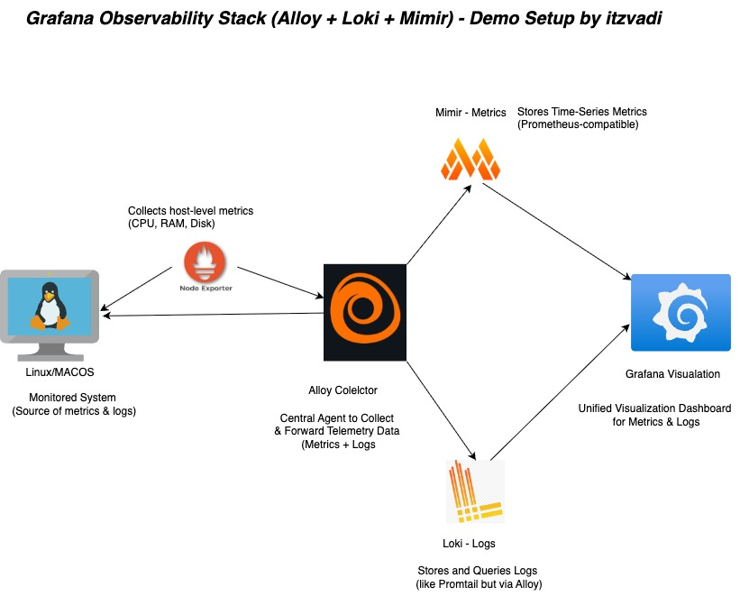

# Grafana Observability Stack (Alloy + Loki + Mimir)



## Overview

This is a demo observability setup that you can run on either **MacOS** or **Linux**. It uses the latest **Grafana OSS stack**, including:

* **Alloy** (successor to Promtail + Agent) for collecting and forwarding telemetry data
* **Loki** for storing and querying logs
* **Mimir** for storing metrics (Prometheus-compatible)
* **Grafana** for visualization (single pane for metrics + logs)

The goal is to demonstrate how a minimal, self-contained observability stack can be used to collect logs and metrics from a local system using Docker Compose.

---

## Stack Components

| Component         | Role            | Default Port | Description                                           |
| ----------------- | --------------- | ------------ | ----------------------------------------------------- |
| **Alloy**         | Collector       | `12345`      | Central collector and forwarder of logs and metrics   |
| **Loki**          | Logs backend    | `3100`       | Stores and queries log data                           |
| **Mimir**         | Metrics backend | `9009`       | Stores time-series metrics (Prometheus-compatible)    |
| **Grafana**       | Visualization   | `3000`       | Dashboard for viewing metrics and logs                |
| **Node Exporter** | Metrics source  | `9100`       | Collects host-level metrics from the monitored system |

---

## Prerequisites

* Docker
* Docker Compose
* Unix-like system (Linux or MacOS)

---

## Running the Stack


### Build and start all services in detached mode
```bash
docker compose up -d --build
```

> Wait a few seconds for all services to initialize.

---

### Stop all running containers and remove volumes
```bash
docker compose down -v
```

---

## Accessing the Services

| Service               | URL                                                            |
| --------------------- | -------------------------------------------------------------- |
| Grafana               | [http://localhost:3000](http://localhost:3000)                 |
| Mimir (Push Endpoint) | `http://localhost:9009/api/v1/push`                            |
| Loki (Push Endpoint)  | `http://localhost:3100/loki/api/v1/push`                       |
| Node Exporter         | [http://localhost:9100/metrics](http://localhost:9100/metrics) |

---

## Dashboards

### ✅ Node Exporter Full (Auto-Provisioned)

The **Node Exporter Full** dashboard (ID: **1860**) is automatically installed via provisioning using the JSON file placed in the Grafana provisioning folder.

You don’t need to import it manually — simply open Grafana and navigate to the dashboard list to find it ready to use.

This dashboard provides a comprehensive overview of system resource metrics, including:

- CPU usage  
- Memory usage  
- Disk I/O  
- Network throughput  

Ensure your data source is configured to a Mimir or Prometheus-compatible endpoint for the metrics to display correctly.


### 🛠️ Loki Logs with Python Log Generator and Dashboard

This setup uses a **Python script** running as a `log_generate` service via the included `Dockerfile` to generate dummy logs continuously. These logs are stored in `tools/logs/dummy.log` and forwarded to **Loki** for ingestion.

You can then visualize and explore these logs in **Grafana** using a **prebuilt dashboard** specifically designed to display all Loki logs in one place, with a clear breakdown by filename.

This provides an end-to-end local observability stack to test log generation, collection, and visualization seamlessly.

---

## Project Structure

```
├── config/                           # Configuration files for services
│   ├── config.alloy
│   ├── loki-config.yaml
│   └── mimir-config.yaml
├── diagrams/                        # Architecture diagrams and drawio files
│   ├── grafana-olly-stack.drawio.drawio
│   └── grafana-olly-stack.jpg
├── docker-compose.yml               # Full docker-compose service definition
├── dockerfile                      # Dockerfile for log_generate service
├── grafana/                        # Grafana provisioning files
│   └── provisioning/
│       ├── dashboards/             # Prebuilt dashboards JSON and YAML
│       │   ├── dashboards.yml
│       │   ├── itzvadi-loki.json
│       │   └── node-exporter.json
│       └── datasources/            # Datasource definitions for Grafana
│           └── datasources.yml
├── README.md                       # This file
└── tools/                         # Python log generator scripts and sample logs
    ├── genDummylogs.py
    └── logs/
        └── dummy.log
```


---

## Credits

Created by **itzvadi** for learning and demo purposes.

If you like it, feel free to ⭐️ the repo and fork it!
